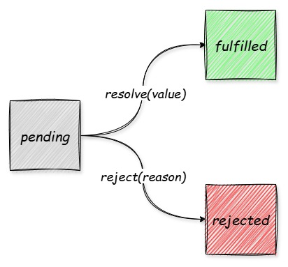
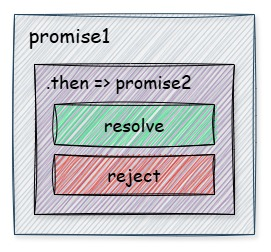
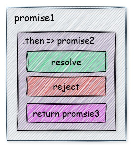
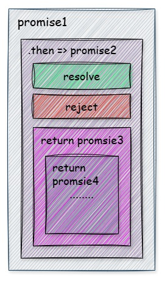

# 手写完整的 Promise

## Promise 和 Promsie A+

从前，在没有 Promise 的时候，为了统一异步操作的写法，社区制定了 Promise A+ 规范。后来 ECMA 在 ES6 中内置了 Promise 对象，遵循了 Promise A+的规范，并扩展了一些方法。

:::info

- [Promise A+ 中文文档](https://promisesaplus.com.cn/)
- [Promise A+ 英文文档](https://promisesaplus.cn/)
  :::

## Promise A+ 规范

可以点击上方的链接阅读一下 Promise A+的规范

:::warning 注意
Promise A+ 中文文档 2.3.1 翻译错误，请参考英文文档！
:::

可见，无论内部实现是什么样子，只要是拥有 `then` 方法的函数或对象，并且行为符合 Promise A+的规范，都被认为是合法的 Promise。所以，所有符合规范的实现，都能互相兼容，下面我们来边解读规范，边实现我们自己的 Promise。

:::tip
社区提供了 Promise A+的测试用例[promises-aplus-tests](https://github.com/promises-aplus/promises-tests/tree/master)，共 872 条用例，我们写完后用它来进行测试。
:::

## 实现完整的 Promise

### 开始

回忆一下 Promise 最基本的使用方式：

```js
const promise1 = new Promise((resolve, reject) => {
  resolve(1);
});

promise.then((value) => {
  console.log(value);
});
```

Promise 是一个类，构造函数中需要传入一个执行器，我们先把他定义出来：

```js
class _Promise {
  constructor(executor) {}
}
```

参考官方的 Promise，如果执行器不是函数，抛出一个 `TypeError`:

```js
class _Promise {
  constructor(executor) {
    if (typeof executor !== "function") {
      throw new TypeError("Promise resolver undefined is not a function"); // [!code ++]
    }
  }
}
```

### 状态和结果

规范 2.1 规定：

:::info
一个 promise 的当前状态必须为以下三种状态中的一种：等待态（Pending）、完成态（Fulfilled）和拒绝态（Rejected）。

- 2.1.1 处于等待态时，promise 需满足以下条件

  - 2.1.1.1 可以迁移至完成态或拒绝态

- 2.1.2 处于完成态时，promise 需满足以下条件

  - 2.1.2.1 不能迁移至其他任何状态
  - 2.1.2.2 必须拥有一个不可变的终值

- 2.1.3 处于拒绝态时，promise 需满足以下条件

  - 2.1.3.1 不能迁移至其他任何状态
  - 2.1.3.2 必须拥有一个不可变的拒绝原因

:::

Promise 的状态机其实很简单，如下图：



我们来实现这部分代码，现在顶部定义三个状态的枚举值：

```js
const PENDING = "pending"; // [!code ++]
const FULFILLED = "fulfilled"; // [!code ++]
const REJECTED = "rejected"; // [!code ++]

class _Promise {
  constructor(executor) {
    if (typeof executor !== "function") {
      throw new TypeError("Promise resolver undefined is not a function");
    }
  }
}
```

给类定义几个私有属性：

```js
class _Promise {
  #status = PENDING; // 初始状态 // [!code ++]
  #value; // 完成后的值 // [!code ++]
  #reason; // 拒绝后的原因 // [!code ++]

  constructor(executor) {
    if (typeof executor !== "function") {
      throw new TypeError("Promise resolver undefined is not a function");
    }
  }
}
```

定义 resolve 和 reject 方法：

```js
class _Promise {
  // ...

  #resolve(value) {
    // [!code ++]
    if (this.#status !== PENDING) {
      // [!code ++]
      return; // 只能从PENDING迁移至其他状态 [!code ++]
    } // [!code ++]
    this.#value = value; // [!code ++]
    this.#status = FULFILLED; // [!code ++]
  }

  #reject(reason) {
    // [!code ++]
    if (this.#status !== PENDING) {
      // [!code ++]
      return; // 只能从PENDING迁移至其他状态 [!code ++]
    } // [!code ++]
    this.#reason = reason; // [!code ++]
    this.#status = REJECTED; // [!code ++]
  }
}
```

执行器是同步执行的，执行时传入这两个方法：

```js
class _Promise {
  // ...

  constructor(executor) {
    if (typeof executor !== "function") {
      throw new TypeError("Promise resolver undefined is not a function");
    }
    // 需要使用trycatch，因为执行器有可能会跑错，需要捕获错误立即reject // [!code ++]
    try {
      // [!code ++]
      // resolve和reject函数需要需要读取私有属性，需要绑定this [!code ++]
      executor(this.#resolve.bind(this), this.#reject.bind(this)); // [!code ++]
    } catch (error) {
      // [!code ++]
      this.#reject(error); // [!code ++]
    } // [!code ++]
  }
}
```

### then 方法

规范中说：

:::info
一个 promise 必须提供一个 then 方法以访问其当前值、终值和拒绝原因。

promise 的 then 方法接受两个参数： `promise.then(onFulfilled, onRejected)`
:::

先定义 then 方法：

```js
class _Promise {
  // ...

  then(onFulfilled, onRejected) {} // [!code ++]
}
```

:::info

- 2.2.1 onFulfilled 和 onRejected 都是可选参数

  - 2.2.1.1 如果 onFulfilled 不是函数，其必须被忽略
  - 2.2.1.2 如果 onRejected 不是函数，其必须被忽略

- 2.2.7 then 方法必须返回一个 promise 对象

  - 2.2.7.3 如果 onFulfilled 不是函数且 promise1 成功完成， promise2 必须成功完成并返回相同的值
  - 2.2.7.4 如果 onRejected 不是函数且 promise1 拒绝完成， promise2 必须拒绝完成并返回相同的拒绝原因

- 2.2.5 onFulfilled 和 onRejected 必须被作为函数调用（即没有 this 值）

:::

这几个如果读着很绕嘴，而且像是前后矛盾，其实说的是同一件事，即：

:::info

- 如果 onFulfilled 不是函数，就用默认值 `(value) => { return value }`
- 如果 onRejected 不是函数，就用默认值 `(reason) => { throw reason }`

:::

我们先来实现这一部分：

```js
class _Promise {
  // ...

  then(onFulfilled, onRejected) {
    // [!code ++:16]
    const promise2 = new _Promise((resolve, reject) => {
      // onFulfilled不是函数，用默认值覆盖
      if (typeof onFulfilled !== "function") {
        onFulfilled = ((value) => {
          return value;
        }).bind(null); // 没有this值，非严格模式下指向globalThis
      }
      // onRejected不是函数，用默认值覆盖
      if (typeof onRejected !== "function") {
        onRejected = ((reason) => {
          throw reason;
        }).bind(null); // 没有this值，非严格模式下指向globalThis
      }
    });

    return promise2;
  }
}
```

继续读规范

:::info

- 2.2.2.1 当 promise 完成结束后 onFulfilled 必须被调用，其第一个参数为 promise 的终值
- 2.2.3.1 当 promise 被拒绝完成后 onRejected 必须被调用，其第一个参数为 promise 的拒绝原因
- 2.2.4 onFulfilled 和 onRejected 只有在完成环境堆栈仅包含平台代码时才可被调用

:::

解读一下这几句话：

:::info

- 状态变为 fulfilled 后，调用 onFulfilled
- 状态变为 rejected 后，调用 onRejected
- 两个方法需要放在微任务中来执行

:::

因为需要放在微任务中执行，我们需要创建一个辅助函数，用来添加一个微任务：

```js
const PENDING = "pending";
const FULFILLED = "fulfilled";
const REJECTED = "rejected";

// [!code ++:21]
function addMicroTask(fn) {
  if (typeof queueMicrotask === "function") {
    queueMicrotask(fn);
  } else if (typeof process.nextTick === "function") {
    process.nextTick(fn);
  } else if (typeof MutationObserver === "function") {
    const observer = new MutationObserver(() => {
      fn();
      observer.disconnect();
      observer = null;
    });
    let ele = document.createTextNode();
    observer.observe(ele, {
      characterData: true,
    });
    ele.data = "1";
    ele = null;
  } else {
    setTimeout(fn);
  }
}
```

考虑下面的代码：

```js
const promise = new Promise((resolve) => {
  resolve(1);
});

promise.then((reuslt) => {
  console.log(result);
});
```

因为 promise 的执行体事同步执行的，并且示例代码中执行体没有异步代码，所以在注册 then 之前，promise 的状态已经是 fulfilled，注册 then 相当于立即执行 then。

再考虑下面的代码：

```js
const promise = new Promise((resolve) => {
  setTimeout(() => {
    resolve(1);
  }, 1000);
});

promise.then((reuslt) => {
  console.log(result);
});
```

在注册 then 的时候 promise 的状态还是 pending，一秒钟后才会变为 fulfilled，所以注册的 then 需要缓存起来，等待 promise 的 resolve。

```js
class _Promise {
  // ...

  then(onFulfilled, onRejected) {
    const promise2 = new _Promise((resolve, reject) => {
      // onFulfilled不是函数，用默认值覆盖
      if (typeof onFulfilled !== "function") {
        onFulfilled = ((value) => {
          return value;
        }).bind(null); // 没有this值，非严格模式下指向globalThis
      }
      // onRejected不是函数，用默认值覆盖
      if (typeof onRejected !== "function") {
        onRejected = ((reason) => {
          throw reason;
        }).bind(null); // 没有this值，非严格模式下指向globalThis
      }

      // [!code ++:13]
      switch (this.#status) {
        case FULFILLED:
          // 立即执行 onFulfilled
          break;
        case REJECTED:
          // 立即执行 onRejected
          break;
        case PENDING:
          // 缓存onFulfilled, onRejected
          break;
        default:
          break;
      }
    });

    return promise2;
  }
}
```

:::info

- 2.2.7.1 如果 onFulfilled 或者 onRejected 返回一个值 x ，则运行下面的 promise 解决过程：[[Resolve]](promise2, x)
- 如果 onFulfilled 或者 onRejected 抛出一个异常 e ，则 TypeError 必须拒绝完成，并返回拒绝原因 e

  :::

先不管 [[Resolve]] 是什么，先按照描述的实现一下：

```js
switch (this.#status) {
  case FULFILLED:
    // [!code ++:8]
    addMicroTask(() => {
      try {
        const x = onFulfilled(this.#value);
        this.#resolvePromise(x, promise2, resolve, reject);
      } catch (error) {
        reject(error);
      }
    });
    break;
  case REJECTED:
    // [!code ++:8]
    addMicroTask(() => {
      try {
        const x = onRejected(this.#reason);
        this.#resolvePromise(x, promise2, resolve, reject);
      } catch (error) {
        reject(error);
      }
    });
    break;
  case PENDING:
    // 缓存onFulfilled, onRejected
    break;
  default:
    break;
}
```

规范中有这样一个条：

:::info

- 2.2.6 then 方法可以被同一个 promise 调用多次

  - 2.2.6.1 当 promise 成功完成时，所有 onFulfilled 需按照其注册顺序依次回调
  - 2.2.6.2 当 promise 被拒绝完成时，所有的 onRejected 需按照其注册顺序依次回调

:::

也就是说，我们可以这样调用 then：

```js
const promise = new Promise((resolve) => {
  resolve(1);
});

promise.then((reuslt) => {
  console.log("第一次：", result);
});

promise.then((reuslt) => {
  console.log("第二次：", result);
});
```

:::info

- 如果调用 then 的时候，promise 的状态不是 pending，那就直接执行 onFulfilled 或 onRejected 就可以了，不需要缓存
- 如果调用 then 的时候，promise 的状态是 pending，那就依次把 onFulfilled 和 onRejected 放到对应的缓存队列中
  :::

我们先来定义一下两个缓存队列：

```js
class _Promise {
  #status = PENDING; // 初始状态
  #value; // 完成后的值
  #reason; // 拒绝后的原因
  // [!code ++:2]
  #onFulfilledQueue = []; // 缓存成功回调
  #onRejectedQueue = []; // 缓存失败回调

  // ...
}
```

然后注册 then 的时候进行 push:

```js
switch (this.#status) {
  // ...

  case PENDING:
    // [!code ++:20]
    this.#onFulfilledQueue.push(() => {
      addMicroTask(() => {
        try {
          const x = onFulfilled(this.#value);
          this.#resolvePromise(x, promise2, resolve, reject);
        } catch (error) {
          reject(error);
        }
      });
    });
    this.#onRejectedQueue.push(() => {
      addMicroTask(() => {
        try {
          const x = onRejected(this.#reason);
          this.#resolvePromise(x, promise2, resolve, reject);
        } catch (error) {
          reject(error);
        }
      });
    });
    break;
}
```

两个私有方法 resolve 和 reject 中，需要将他们依次取出执行：

```js
class _Promise {
  // ...

  #resolve(value) {
    if (this.#status !== PENDING) {
      return; // 只能从PENDING迁移至其他状态
    }
    this.#value = value;
    this.#status = FULFILLED;
    // [!code ++:3]
    while (this.#onFulfilledQueue.length) {
      this.#onFulfilledQueue.shift()(value);
    }
  }

  #reject(reason) {
    if (this.#status !== PENDING) {
      return; // 只能从PENDING迁移至其他状态
    }
    this.#reason = reason;
    this.#status = REJECTED;
    // [!code ++:3]
    while (this.#onRejectedQueue.length) {
      this.#onRejectedQueue.shift()(reason);
    }
  }
}
```

至此，then 的注册我们就完成了。

### 解决过程 resolvePromise

刚才我们遗留了一个问题：`resolvePromise`，我们来完成它，先看规范中是如何描述它的：

:::info

解决过程是一个抽象的操作，其需输入一个 promise 和一个值，我们表示为 [[Resolve]](promise, x)，如果 x 有 then 方法且看上去像一个 promise ，解决程序即尝试使 promise 接受 x 的状态；否则其用 x 的值来完成 promise 。

:::

这段话的意思是：

:::info

- 这个方法入参中的 x 可能是任意类型的值
- 如果是一个 thenable，就使用他的 fulfilled 或 rejected 状态，如果仍然返回一个 thenable，就继续尝试解决过程
- 如果不是 thenable，就直接 resolve 这个 x

:::

还是一知半解？没关系，我们先来定义这个方法：

```js
class _Promise {
  // ...

  // [!code ++:1]
  #resolvePromise(x, promise2, resolve, reject) {}
}
```

继续看官方的规范：

:::info

- 2.3.1 If promise and x refer to the same object, reject promise with a TypeError as the reason.

:::

这就是最开始提到的中文文档翻译错误的那条规则，意思就是：x 和 promise2 不能相等，否则会造成死循环，需要抛错，我们来实现一下：

```js
class _Promise {
  // ...

  #resolvePromise(x, promise2, resolve, reject) {
    // [!code ++:3]
    if (x === promise2) {
      throw new TypeError("The promise and the return value are the same");
    }
  }
}
```

继续看规范：

:::info

- 2.3.2 如果 x 为 promise ，则使 promise 接受 x 的状态
- 2.3.3 如果 x 为对象或者函数
- 2.3.4 如果 x 不为对象或者函数，以 x 为参数完成 promise

:::

这三条规则中第一条和第二条说的其实是同一件事，2.3.2 说的是 x 是一个 promise，也就是一个 thenable，2.3.3 中如果 x 为对象的话，有可能也是一个 thenable，两个逻辑其实重复了，所以 2.3.2 我们可以忽略掉，归并到 2.3.3 中进行处理，我们来实现一下：

```js
class _Promise {
  // ...

  #resolvePromise(x, promise2, resolve, reject) {
    if (x === promise2) {
      throw new TypeError("The promise and the return value are the same");
    }
    // [!code ++:5]
    if ((typeof x === "object" || typeof x === "function") && x !== null) {
      // 有可能是个thenable
    } else {
      resolve(x);
    }
  }
}
```

接下来我们来处理最重点规则 2.3.3，继续读规范：

:::info

- 2.3.3.1 把 x.then 赋值给 then
- 2.3.3.2 如果取 x.then 的值时抛出错误 e ，则以 e 为拒绝原因拒绝 promise
- 2.3.3.3.3 如果 resolvePromise 和 rejectPromise 均被调用，或者被同一参数调用了多次，则优先采用首次调用并忽略剩下的调用

:::

2.3.3.1 和 2.3.3.2 都容易理解，但 2.3.3.3.3 是什么意思？

首先，Promise A+ 规范其实很宽松，只是检测一个对象或函数有没有 then 方法，但如果有人伪造一个 thenable 呢？有如下几种情况：

在取 then 的时候报错，需要 catch：

```js
const fakePromise = {
  get then() {
    throw new Error("报错了");
  },
};

const then = fakePromise.then; // Uncaught Error
```

在执行的时候报错，需要 catch：

```js
const fakePromise = {
  then() {
    throw new Error("报错了");
  },
};

fakePromise.then(); // Uncaught Error
```

在执行的时候，试图多次改变 promise 的状态甚至改变状态后强行报错：

```js
const fakePromise = {
  then(resolve, reject) {
    resolve(); // 先变成fulfilled
    reject(); // 再变成rejected
    throw new Error("报错了"); // 再报个错
  },
};

fakePromise.then(onFulfilled, onRejected); // Uncaught Error
```

这几种情况都是不符合规范的，所以我们需要：

:::info

- 解析 thenable 的时候，用 trycatch 包起来，报错的话，执行 reject
- 每次状态变更后，记下 HAS_CALL 为 true，避免二次执行

:::

我们来实现一下：

```js
class _Promise {
  // ...

  #resolvePromise(x, promise2, resolve, reject) {
    if (x === promise2) {
      throw new TypeError('The promise and the return value are the same');
    }
    if ((typeof x === 'object' || typeof x === 'function') && x !== null) {
      // [!code ++:14]
      let HAS_CALLED = false;
      try {
        const then = x.then;
        if (typeof then === 'function') {
          // 一定是个thenable
        } else {
          /**
           * 这个地方可以不加HAS_CALLED的判断，因为：
           * 唯一可以恶意操作的地方就是读取then的时候，下面已经保护了
           * 所以进到这，一定是正常的
           * 当然，加上HAS_CALLED的判断也没问题
           */
          resolve(x);
        }
    } else {
      resolve(x);
    }
  }
}
```

继续读规范：

:::info

- 2.3.3.3 如果 then 是函数，将 x 作为函数的作用域 this 调用之。传递两个回调函数作为参数，第一个参数叫做 resolvePromise ，第二个参数叫做 rejectPromise

:::

实现如下：

```js
class _Promise {
  // ...

  #resolvePromise(x, promise2, resolve, reject) {
    if (x === promise2) {
      throw new TypeError('The promise and the return value are the same');
    }
    if ((typeof x === 'object' || typeof x === 'function') && x !== null) {
      let HAS_CALLED = false;
      try {
        const then = x.then;
        if (typeof then === 'function') {
          // [!code ++:9]
          then.call(
            x,
            value => {
              // resolvePromise
            },
            reason => {
              // rejectPromise
            }
          )
        } else {
          resolve(x);
        }
    } else {
      resolve(x);
    }
  }
}
```

下面就是这两个方法被调用的时候，其实就是 then 方法的 onFulfilled 和 onRejected，先来实现 rejectPromise

```js
class _Promise {
  // ...

  #resolvePromise(x, promise2, resolve, reject) {
    if (x === promise2) {
      throw new TypeError('The promise and the return value are the same');
    }
    if ((typeof x === 'object' || typeof x === 'function') && x !== null) {
      let HAS_CALLED = false;
      try {
        const then = x.then;
        if (typeof then === 'function') {
          then.call(
            x,
            value => {
              // resolvePromise
            },
            reason => {
              // [!code ++:5]
              if (HAS_CALLED) {
                return;
              }
              HAS_CALLED = true;
              reject(reason);
            }
          )
        } else {
          resolve(x);
        }
    } else {
      resolve(x);
    }
  }
}
```

最后来实现 resolvePromise，看下规范：

:::info

- 如果 resolvePromise 以值 y 为参数被调用，则运行 [[Resolve]](promise, y)

:::

解释一下就是，无论 then.call 的 onFulfilled 的入参 value 为什么类型，只要执行了 onFulfilled，就对这个 value 进行下一轮处理，下一轮会去判断他的类型， 实现一下：

```js
class _Promise {
  // ...

  #resolvePromise(x, promise2, resolve, reject) {
    if (x === promise2) {
      throw new TypeError('The promise and the return value are the same');
    }
    if ((typeof x === 'object' || typeof x === 'function') && x !== null) {
      let HAS_CALLED = false;
      try {
        const then = x.then;
        if (typeof then === 'function') {
          then.call(
            x,
            value => {
              // [!code ++:5]
              if (HAS_CALLED) {
                return;
              }
              HAS_CALLED = true;
              this.#resolvePromise(value, promise2, resolve, reject);
            },
            reason => {
              if (HAS_CALLED) {
                return;
              }
              HAS_CALLED = true;
              reject(reason);
            }
          )
        } else {
          resolve(x);
        }
    } else {
      resolve(x);
    }
  }
}
```

## Promise A+ 规范实现完成

至此，Promise A+规范我们就实现完成了，看一下完整代码：

```js
const PENDING = "pending";
const FULFILLED = "fulfilled";
const REJECTED = "rejected";

function addMicroTask(fn) {
  if (typeof queueMicrotask === "function") {
    queueMicrotask(fn);
  } else if (typeof process.nextTick === "function") {
    process.nextTick(fn);
  } else if (typeof MutationObserver === "function") {
    const observer = new MutationObserver(() => {
      fn();
      observer.disconnect();
      observer = null;
    });
    let ele = document.createTextNode();
    observer.observe(ele, {
      characterData: true,
    });
    ele.data = "1";
    ele = null;
  } else {
    setTimeout(fn);
  }
}

class _Promise {
  #status = PENDING; // 初始状态
  #value; // 完成后的值
  #reason; // 拒绝后的原因
  #onFulfilledQueue = []; // 缓存成功回调
  #onRejectedQueue = []; // 缓存失败回调

  constructor(executor) {
    if (typeof executor !== "function") {
      throw new TypeError("Promise resolver undefined is not a function");
    }
    // 需要使用trycatch，因为执行器有可能会跑错，需要捕获错误立即reject
    try {
      // resolve和reject函数需要需要读取私有属性，需要绑定this
      executor(this.#resolve.bind(this), this.#reject.bind(this));
    } catch (error) {
      this.#reject(error);
    }
  }

  #resolve(value) {
    if (this.#status !== PENDING) {
      return; // 只能从PENDING迁移至其他状态
    }
    this.#value = value;
    this.#status = FULFILLED;
    while (this.#onFulfilledQueue.length) {
      this.#onFulfilledQueue.shift()(value);
    }
  }

  #reject(reason) {
    if (this.#status !== PENDING) {
      return; // 只能从PENDING迁移至其他状态
    }
    this.#reason = reason;
    this.#status = REJECTED;
    while (this.#onRejectedQueue.length) {
      this.#onRejectedQueue.shift()(reason);
    }
  }

  #resolvePromise(x, promise2, resolve, reject) {
    if (x === promise2) {
      throw new TypeError("The promise and the return value are the same");
    }
    if ((typeof x === "object" || typeof x === "function") && x !== null) {
      let HAS_CALLED = false;
      try {
        const then = x.then;
        if (typeof then === "function") {
          then.call(
            x,
            (value) => {
              if (HAS_CALLED) {
                return;
              }
              HAS_CALLED = true;
              this.#resolvePromise(value, promise2, resolve, reject);
            },
            (reason) => {
              if (HAS_CALLED) {
                return;
              }
              HAS_CALLED = true;
              reject(reason);
            }
          );
        } else {
          resolve(x);
        }
      } catch (error) {
        if (HAS_CALLED) {
          return;
        }
        HAS_CALLED = true;
        reject(error);
      }
    } else {
      resolve(x);
    }
  }

  then(onFulfilled, onRejected) {
    const promise2 = new _Promise((resolve, reject) => {
      // onFulfilled不是函数，用默认值覆盖
      if (typeof onFulfilled !== "function") {
        onFulfilled = ((value) => {
          return value;
        }).bind(null); // 没有this值，非严格模式下指向globalThis
      }
      // onRejected不是函数，用默认值覆盖
      if (typeof onRejected !== "function") {
        onRejected = ((reason) => {
          throw reason;
        }).bind(null); // 没有this值，非严格模式下指向globalThis
      }

      switch (this.#status) {
        case FULFILLED:
          addMicroTask(() => {
            try {
              const x = onFulfilled(this.#value);
              this.#resolvePromise(x, promise2, resolve, reject);
            } catch (error) {
              reject(error);
            }
          });
          break;
        case REJECTED:
          addMicroTask(() => {
            try {
              const x = onRejected(this.#reason);
              this.#resolvePromise(x, promise2, resolve, reject);
            } catch (error) {
              reject(error);
            }
          });
          break;
        case PENDING:
          this.#onFulfilledQueue.push(() => {
            addMicroTask(() => {
              try {
                const x = onFulfilled(this.#value);
                this.#resolvePromise(x, promise2, resolve, reject);
              } catch (error) {
                reject(error);
              }
            });
          });
          this.#onRejectedQueue.push(() => {
            addMicroTask(() => {
              try {
                const x = onRejected(this.#reason);
                this.#resolvePromise(x, promise2, resolve, reject);
              } catch (error) {
                reject(error);
              }
            });
          });
          break;
        default:
          break;
      }
    });

    return promise2;
  }
}
```

## 测试一下

我们使用社区提供的 `promises-aplus-tests` 进行测试，先安装一下：

```bash
npm install promises-aplus-tests
```

编辑一下 package.json:

```json
{
  "scripts": {
    "test": "promises-aplus-tests ./index.js"
  }
}
```

在我们的代码下方添加如下：

```js
_Promise.deferred = function () {
  var result = {};
  result.promise = new _Promise(function (resolve, reject) {
    result.resolve = resolve;
    result.reject = reject;
  });

  return result;
};

module.exports = _Promise;
```

执行 test 命令，872 条用例测试通过了！

```bash
872 passing (20s)
```

## ES6 的 Promise 呢？

ES6 的 Promise 在 Promise A+的基础上增加了一系列的方法，如下：

:::info

- catch
- finally
- static resolve
- static reject
- static all
- static race
- static allSettled

:::

我们一个一个来实现~

### catch

then 接受两个参数，onFulfilled 和 onRejected，catch 其实就是只传了 onRejected 的 then，同样返回一个 promise，以下两组代码的效果是等价的：

```js
const promise = new Promise((_, reject) => {
  reject("出错啦");
});

promise.then(
  () => {},
  (reason) => {
    console.log(reason); // 执行器出错了，会进到这里
  }
);
```

等价于：

```js
const promise = new Promise((_, reject) => {
  reject("出错啦");
});

promise.catch((err) => {
  console.log(err);
});
```

所以 catch 的实现为：

```js
class _Promise {
  // ...

  catch(onRejected) {
    return this.then(null, onRejected);
  }
}
```

### finally

finally 方法无论 promise 的状态是 fulfilled 还是 rejected，都会执行，同样返回一个 promise，但是不接受参数，而是把参数向后传递或向外抛出，比如：

```js
const promise = new Promise((_, reject) => {
  reject("出错啦");
});

promise
  .finally((value) => {
    console.log(value); // undefined
  })
  .catch((err) => {
    console.log(err); // 出错啦
  });
```

所以 finally 的实现为：

```js
class _Promise {
  // ...

  finally(onFinally) {
    return this.then(
      (value) => {
        onFinally();
        return value;
      },
      (reason) => {
        this.finally();
        throw reason;
      }
    );
  }
}
```

### resolve

MDN 上说明：

:::info

Promise.resolve() 静态方法以给定值“解决（resolve）”一个 Promise。如果该值本身就是一个 Promise，那么该 Promise 将被返回；如果该值是一个 thenable 对象，Promise.resolve() 将调用其 then() 方法及其两个回调函数；否则，返回的 Promise 将会以该值兑现。

:::

所以 resolve 的实现为：

```js
class _Promise {
  // ...

  static resolve(value) {
    if (value instanceof _Promise) {
      return value;
    }
    return new _Promise((resolve, reject) => {
      if (
        (typeof value === "object" || typeof value === "function") &&
        value !== null
      ) {
        let HAS_CALLED = false;
        try {
          const then = value.then;
          if (typeof then === "function") {
            then.call(value, resolve, reject);
          } else {
            resolve(value);
          }
        } catch (error) {
          if (HAS_CALLED) {
            return;
          }
          HAS_CALLED = true;
          reject(error);
        }
      } else {
        resolve(value);
      }
    });
  }
}
```

### reject

MDN 上说：

:::info

Promise.reject() 静态方法返回一个已拒绝（rejected）的 Promise 对象，拒绝原因为给定的参数。

:::

所以 reject 的实现为：

```js
class _Promise {
  // ...

  static reject(value) {
    return new _Promise((_, reject) => {
      reject(value);
    });
  }
}
```

### all

MDN 上说明：

:::info

Promise.all() 静态方法接受一个 Promise 可迭代对象作为输入，并返回一个 Promise。当所有输入的 Promise 都被兑现时，返回的 Promise 也将被兑现（即使传入的是一个空的可迭代对象），并返回一个包含所有兑现值的数组。如果输入的任何 Promise 被拒绝，则返回的 Promise 将被拒绝，并带有第一个被拒绝的原因。

:::

Promise.all 的入参不一定是一个数组，是一个实现了[Symbol.iterator] 接口的数据类型，所以不能用 for 循环进行遍历，应该使用 forof 来进行迭代器的遍历，实现如下：

```js
class _Promise {
  // ...

  static all(targets) {
    return new _Promise((resolve, reject) => {
      const results = [];
      let restCount = 0;

      for (const t of targets) {
        const index = restCount++;
        _Promise.resolve(t).then((value) => {
          results[index] = value;
          restCount--;
          if (restCount === 0) {
            resolve(results);
          }
        }, reject);
      }

      if (restCount === 0) {
        resolve([]);
      }
    });
  }
}
```

### race

MDN 上说明：

:::info

Promise.race() 静态方法接受一个 promise 可迭代对象作为输入，并返回一个 Promise。这个返回的 promise 会随着第一个 promise 的敲定而敲定。

:::

所以 race 的实现为：

```js
class _Promise {
  // ...

  static race(targets) {
    return new _Promise((resolve, reject) => {
      for (const t of targets) {
        _Promise.resolve(t).then(resolve, reject);
      }
    });
  }
}
```

### allSettled

MDN 上说明：

:::info

Promise.allSettled() 静态方法将一个 Promise 可迭代对象作为输入，并返回一个单独的 Promise。当所有输入的 Promise 都已敲定时（包括传入空的可迭代对象时），返回的 Promise 将被兑现，并带有描述每个 Promise 结果的对象数组。

:::

所以 allSettled 的实现为：

```js
class _Promise {
  // ...

  static allSettled(targets) {
    return new _Promise((resolve) => {
      const results = [];
      let restCount = 0;

      for (const t of targets) {
        const index = restCount++;
        _Promise
          .resolve(t)
          .then(
            (value) => {
              results[index] = { status: FULFILLED, value };
            },
            (reason) => {
              results[index] = { status: REJECTED, reason };
            }
          )
          .finally(() => {
            restCount--;
            if (restCount === 0) {
              resolve(results);
            }
          });
      }

      if (restCount === 0) {
        resolve([]);
      }
    });
  }
}
```

## 解决过程 resolvePromise 中的参数疑惑

在规范中，resolvePromise 的参数描述的是：`[[Resolve]](promise, x)`，但我们的代码中 resolvePromise 却有四个入参，并且再次调用自己的时候还会将后两个参数`resolve`、`reject`继续透传，如下代码中高亮的两行：

```js{4,20}
class _Promise {
  // ...

  #resolvePromise(x, promise2, resolve, reject) {
    if (x === promise2) {
      throw new TypeError('The promise and the return value are the same');
    }
    if ((typeof x === 'object' || typeof x === 'function') && x !== null) {
      let HAS_CALLED = false;
      try {
        const then = x.then;
        if (typeof then === 'function') {
          then.call(
            x,
            value => {
              if (HAS_CALLED) {
                return;
              }
              HAS_CALLED = true;
              this.#resolvePromise(value, promise2, resolve, reject);
            },
            reason => {
              if (HAS_CALLED) {
                return;
              }
              HAS_CALLED = true;
              reject(reason);
            }
          )
        } else {
          resolve(x);
        }
    } else {
      resolve(x);
    }
  }
}
```

这是为什么呢？假设我们有如下这样一个 Promise：

```js
const promise1 = new Promise((resolve) => {
  resolve();
});

promise1.then(() => {
  return 1;
});
```

首先我们知道，then 方法返回的一定是一个 promise，promise 中导出了`resovle`和`reject`，如下图：



如果像这个示例中，then 中 return 了一个非 thenable 的值的话，直接调用 resolve 就可以了，不会走到再次 resolvePromise 的逻辑中，但如果是下面这种情况呢？

```js
const promise1 = new Promise((resolve) => {
  resolve();
});

promise1.then(() => {
  return Promise.resolve(1);
});
```



在上述示例中，可以看到，then 中又 return 了一个 promise，针对这种情况，需要对其进行继续执行 resolvePromise，如果这个 promise3 中又返回了一个 promise 呢？有可能会向下图一样嵌套很多层：



这时需要把嵌套的 promise 一层一层的解开，直到解出一个非 thenable 的值，然后最为图中 promise2 的最终值，resolve 出去，所以解决 promise2 的时候，需要把这个 promise 最根级的 resolve 和 reject 一直向下透传，也就是说，在一个 then 方法中嵌套的所有 promise，最终调用都是这个 then 所对应的 promise 的 resolve 和 reject。

## 一道诡异的题目

我们都知道，promise 中的执行器，是调用后立即同步执行的，then 方法是需要注册到微任务里，等待所有同步代码执行完成后，再去依次执行的，所以对于下面这道题目：

```js
Promise.resolve()
  .then(() => {
    console.log(0);
    return Promise.resolve(4);
  })
  .then((res) => {
    console.log(res);
  });

Promsie.resolve()
  .then(() => {
    console.log(1);
  })
  .then(() => {
    console.log(2);
  })
  .then(() => {
    console.log(3);
  })
  .then(() => {
    console.log(5);
  })
  .then(() => {
    console.log(6);
  });
```

这个例子中有一个特殊的地方，就是 then 中的`return Promise.resolve(4)`，我们知道，当 then 中 return 了一个 promise 的时候，会尝试解决最终值，所以对于 return Promise.reoslve(4) 需要调用一次这个 promise 的 then 方法，也就是说，会多产生一次微任务。所以，这个蒂姆，我们可以改写成这样：

```js
Promise.resolve()
  .then(() => {
    console.log(0);
    return 4;
  })
  .then()
  .then((res) => {
    console.log(res);
  });

Promsie.resolve()
  .then(() => {
    console.log(1);
  })
  .then(() => {
    console.log(2);
  })
  .then(() => {
    console.log(3);
  })
  .then(() => {
    console.log(5);
  })
  .then(() => {
    console.log(6);
  });
```

相当于多出一次空的 then，那我们知道，then 中的 onFulfilled 的类型不是 function 的话，会用`value => value`来赋默认值，所以返回的 4 会透传到下一个 then 中，然后利用事件循环机制，我们很容易得出输出结果为：

```js
// 0 1 2 4 3 5 6
```

使用我们手写的\_Promise 尝试一下，输出结果为：

```js
// 0 1 2 4 3 5 6
```

看上去正确了，是不是？我们再来用原生的 Promise 来看一下输出结果：

```js
// 0 1 2 3 4 5 6
```

和我们实现的不一样？诡异的事情出现了，我们的代码明明通过了所有测试用例啊？所以我们怀疑，是不是原生的 Promise 和 Promise A+规范存在细微的差别？

查阅互联网我们的得知，V8 引擎在 resolvePromise 中，如果遇到 thenable 的对象，会把新的解决过程放到一个微任务中去执行，具体可查看这篇掘金文章：[【V8 源码补充篇】从一道让我失眠的 Promise 面试题开始，深入分析 Promise 实现细节](https://juejin.cn/post/6953452438300917790#heading-3)，这就是 V8 和 Promise A+规范存在差异的地方，所以我们需要改写一下我们的 resolvePromise 方法：

```js
class _Promise {
  // ...

  #resolvePromise(x, promise2, resolve, reject) {
    if (x === promise2) {
      throw new TypeError("The promise and the return value are the same");
    }
    if ((typeof x === "object" || typeof x === "function") && x !== null) {
      let HAS_CALLED = false;
      try {
        const then = x.then;
        if (typeof then === "function") {
          then.call(
            x,
            (value) => {
              if (HAS_CALLED) {
                return;
              }
              HAS_CALLED = true;
              // [!code ++]
              addMicroTask(() => {
                this.#resolvePromise(value, promise2, resolve, reject);
                // [!code ++]
              });
            },
            (reason) => {
              if (HAS_CALLED) {
                return;
              }
              HAS_CALLED = true;
              reject(reason);
            }
          );
        } else {
          resolve(x);
        }
      } catch (error) {
        if (HAS_CALLED) {
          return;
        }
        HAS_CALLED = true;
        reject(error);
      }
    } else {
      resolve(x);
    }
  }
}
```

将 then 的执行过程，包裹在一个新的微任务中，就和 V8 的行为保持一致了，我们再来测试一下，输出如下：

```js
// 0 1 2 3 4 5 6
```

问题解决，再来跑一下 Promise A+ 的测试用例，仍然全部通过，大功告成！
