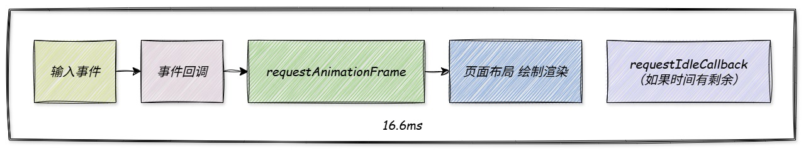
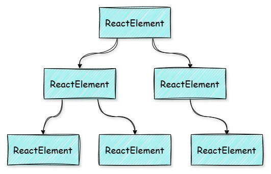
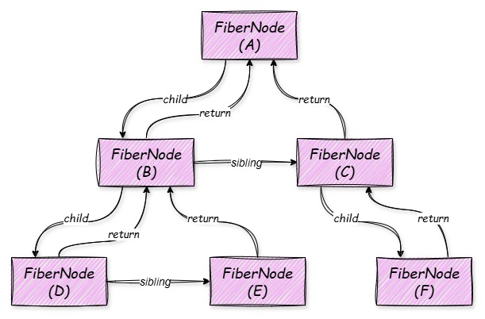
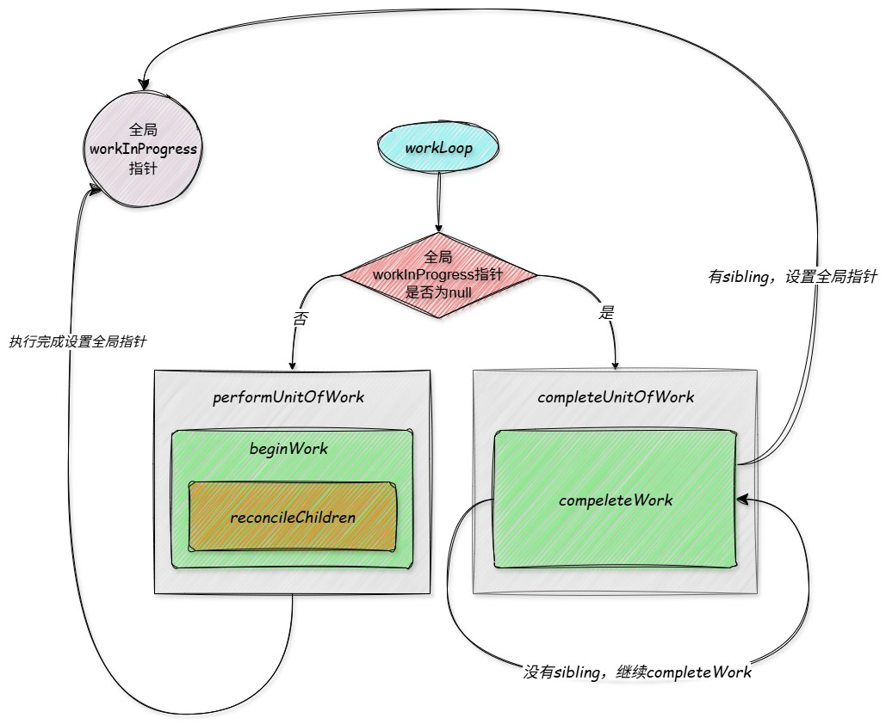

# 什么是 Fiber 架构？

## 浏览器的一帧

了解 Fiber 架构之前，先了解一下浏览在一帧的过程中都会做哪些事:

浏览器的每秒 60 帧，一帧大约为 16.6ms，在一帧期间，会做如下几件事：

:::info

- 处理输入事件，如 click、input 等
- 触发事件回调
- 触发 `requestAnimationFrame` 准备绘制页面
- 绘制完成后，如果一帧时间还有剩余，就调用 `requestIdleCallback` 执行注册的回调
  :::

JS 引擎和页面渲染引擎都在浏览器的渲染进程中，他们之间的执行是串行的关系，如果页面布局之前执行了一个长任务，导致一帧的时间超过了 16.6ms，页面就会出现卡顿，影响用户体验。

## 旧版 React 存在的问题

在旧版的 React 中，虚拟 DOM 树是由我们上一篇文章提到的 `ReactElement` 组成的

diff 的过程为：

:::info

- 从根节点开始，采用深度递归的方式进行对比
- 由于递归的特性，一旦开始，便无法暂停，只能等待执行完成
- diff 和 commit 交替进行，发现某个节点发生了变更，立即修改真实 DOM，即 diff -> commit -> diff -> commit -> ...
  :::

这种递归方式存在几个问题：

:::info

- 一旦页面内容变多，diff 的过程就会很长，一旦 diff 的时间超过 16.6ms 就会影响浏览器的渲染，还会阻塞用户的交互
- diff 和 commit 交替进行，如果中途出错，用户有可能会看到更新了一半的页面（实际上 React 在检测到错误的时候会将 DOM 树卸载掉，但这不符合直觉）
  :::

## 有什么需要解决的问题？

针对以上问题，React 团队觉得：

::: info

- 将 diff 的递归算法转换为深度优先遍历的循环算法
- 让 diff 的过程变成一个个小块的任务，在浏览器渲染的空闲时间执行小块 diff 任务
- diff 过程可暂停，暂停后，可以从暂停的地方继续开始
- 针对不同类型的更新，采用不同的优先级，比如用户的点击输入事件的优先级高于副作用优先级等，高优先级可以打断递优先级
- 采用双缓存机制，同时存在两棵虚拟 DOM 树，current 对应当前页面上显示的 DOM，wip 用来执行 diff，diff 的过程中，current 树不受影响
  :::

于是便产生了 Fiber 架构。

## Fiber 树

了解了 Fiber 架构诞生的目的后，我们先来看一下 Fiber 架构中的虚拟 DOM 树，新的虚拟 DOM 树（Fiber 树）是由一个个 FiberNode 构成的，每个节点包含三个与树结构相关的属性：

:::info

- return 父节点
- child 第一个子节点
- sibling 右边的兄弟节点
  :::

一棵 Fiber 树的大致结构如下图所示：

通过每个节点的三指针结构，可以将从前的递归遍历，变为现在的深度优先遍历，过程如下:

:::info

- 进入 A，A 有 child，进入 B
- B 有 child，进入 D
- D 没有 child，但有 sibling，进入 E
- E 没有 child，也没有 sibling，回到 B
- B 有 sibling，进入 C
- C 有 child，进入 F
- F 没有 child，也没有 sibing，回到 C
- C 回到 A
- 遍历结束
  :::

可以发现，整个递归过程包括向下的 `递` 和向上的 `归`，其中：

::: info

- `递` 的过程找每一个节点的 child，有 child 就进入 child，没有 child 就进入 `归`
- `归` 的过程优先找每个节点的 sibling，有 sibling 就进入 sibling，没有的话就通过 return 指针返回上个节点
- 每个 sibling 阶段被遍历到之后，又是一次 `递` 的过程
  :::

在这个过程中，如果定义一个全局指针，指向当前进入的节点，就能做到在遍历被打断后，从当前节点恢复执行。

## Fiber 架构的三个阶段

本章先对这些名词有一个基本的概念，具体内容后面章节讲解，Fiber 架构分为三个阶段，分别为：

:::info

- Schedule（调度）
- Render（渲染，生成新的虚拟 DOM 树）
- Commit（将虚拟 DOM 提交到页面上）
  :::

下面来概括性的介绍一下三个阶段都做了什么，不讲具体实现，先领悟思想。

## Schedule 阶段

以页面的更新渲染举例，触发更新渲染的途径有两个：

:::info

- 用户触发的一系列事件（比如 onClick、onInput 等）引起了组件 state 的变化
- 组件中的副作用引起了 state 的变化
  :::

React 中有一个很重要的概念叫做：`批量更新，异步渲染`，每个状态更新（如 useState 的 dispatch）都会触发 schedule，schedule 所做的就是按照触发事件的优先级，将一个时间切片中的连续触发的事件进行批量处理，并且高优先级任务可以打断低优先级任务。

## Render 阶段

还是以页面更新渲染举例，触发一次更新的 disptach 后，经过 schedule 的调度，最终会进入 render 阶段，我们先不考虑优先级打断的情况，整个 render 阶段是一个 `WorkLoop`，循环遍历我们上文提到的 Fiber 树，分为几个步骤：

:::info

- `performUnitOfWork`（执行一个任务单元）：针对某一个 FiberNode，开始 `beginWork`
- `beginWork` （向下递）：根据 FiberNode 的 tag，执行不同的渲染函数，比如类组件的 instance.render，函数组件直接执行等，执行完成后的得到这个 FiberNode 的下一级 children，进入 `reconcileChildren` 阶段
- `reconcileChildren`（diff 阶段）：根据新节点的个数是否大于 1，使用单节点、多节点的 diff 方式，给需要更新、新增、删除的节点打上相应的副作用标记，并给节点绑定三指针，让 `child` 指针进入下一次 `workLoop` 循环
- 如果进入 `workLoop` 的 FiberNode 为 null 了，证明一条路径的深度已经到头，就开始 `compeleteUnitOfWork`
- `compeleteUnitOfWork`（向上归）：调用 `compeleteWork` 将 FiberNode 的副作用标记向上冒泡，并生成真实的 DOM，存在 FiberNode.stateNode 上，然后看是否有 `sibling`，有的话返回 `sibling` 指针，否则返回 `return` 指针，进入下一次 `workLoop`
  :::

很多名词晦涩难懂，我们后面的章节在详细介绍，先放一张图感受一下：

## Commit 阶段

commit 的工作主要是：

:::info

- 将虚拟 DOM 通过浏览器 DOM api 同步到页面上，这个过程一旦开始不可中断
- 执行特定的生命周期和副作用回调等
  :::

## 最后

本章只介绍了 fiber 架构的基本还有很多东西没有涉及，比如 `Lane模型`、`自动批处理`、`并发渲染` 等，后面的章节会渐进式的讲解。

## 问题

### Q1: Fiber 架构的出现主要为了解决什么问题？

:::details 答案
在旧版本的 React 中，虚拟 DOM 树的 diff 是采用递归遍历的方式，有几个明显的问题：

- 因为是递归方式，所以一旦开始无法停止，一旦时间超过 16.6ms，就会引起页面渲染卡顿掉帧
- 采用 diff 和 commit 交替进行的方式，diff 一点，修改一点页面，如果中途停止，就会让用户看到不完整的页面（但 React 做了保护，卸载掉整棵 DOM 树）

Fiber 结构的出现，解决的问题如下：

- 采用三指针链表的形式，将递归改为深度优先遍历（循环），将当前遍历到的节点保存在全局指针 workInProgress 上，使 diff 过程可以随时暂停，并且可以从暂停的地方重新开始 diff
- 将大的 diff 任务拆分成小块，代码中体现为 `performUnitOfWork`、`compelteUnitOfWork`，在浏览器渲染空余时间进行 diff
- 采用双缓存机制，同时存在`current`、`workInProgress`两棵虚拟 DOM 树，diff 只修改 `workInProgress`，`current` 不受影响，不会有让用户看到页面的中间态的风险
- 通过 schedule 的调度，实现 `批量更新、异步渲染`
  :::
