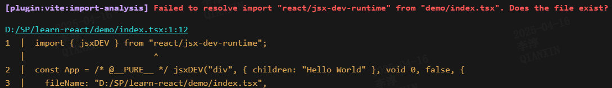
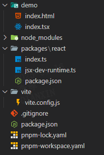

# 准备工作

## 创建 monorepo

原版的 React 采用 monorepo 的方式，将所有子包维护在同一个仓库下，我们使用 pnpm 来初始化一个 monorepo 项目。

在项目根路径执行：

```bash
# /
pnpm init
```

新建 `pnpm-workspace.yaml` 文件，将 packages 文件夹下第一层目录识别成子包：

```yaml
# /pnpm-workspace.yaml
packages:
  - 'packages/*'
```

新建 packages/react 目录，进入目录执行：

```bash
# /packages/react
pnpm init
```

修改/packages/react/package.json：

```json
// /packages/react/package.json
{
  "name": "react",
  "version": "1.0.0",
  "description": "",
  // [!code ++]
  "module": "index.ts",
  "keywords": [],
  "author": "",
  "license": "ISC",
  "packageManager": "pnpm@10.6.4"
}
```

新建 /packages/react/index.ts：

```js
// /packages/react/index.ts
export default {};
```

第一个子包就创建好了，后面再创建子包都是同样的方法。

## 创建测试项目

我们希望模拟 React 的引入方式来对源码进行实时的调教，我们选用 vite 来实现：

根路径下执行：

```bash
# /
pnpm i vite @vitejs/plugin-react
```

创建 demo 文件：

```html
<!-- /demo/index.html -->
<!DOCTYPE html>
<html lang="en">
  <head>
    <meta charset="UTF-8" />
    <meta
      name="viewport"
      content="width=device-width, initial-scale=1.0"
    />
    <title>Document</title>
  </head>
  <body>
    <div id="root"></div>
    <script
      type="module"
      src="./index.tsx"
    ></script>
  </body>
</html>
```

```js
// /demo/index.tsx
const App = <div>Hello World</div>;

console.log(App);
```

创建 vite 配置文件：

```js
// /vite/vite.config.js
import { defineConfig } from 'vite';
import react from '@vitejs/plugin-react';

export default defineConfig({
  plugins: [
    react({
      jsxRuntime: 'automatic',
    }),
  ],
});
```

修改 package.json 文件：

```json
// /package.json
{
  "name": "learn-react",
  "version": "1.0.0",
  "description": "",
  "module": "index.ts",
  "scripts": {
    // [!code ++]
    "demo": "vite serve demo --config vite/vite.config.js --force"
  },
  "keywords": [],
  "author": "",
  "license": "ISC",
  "packageManager": "pnpm@10.6.4",
  "dependencies": {
    "@vitejs/plugin-react": "^4.4.0",
    "vite": "^6.2.6"
  }
}
```

根路径下执行：

```bash
# /
pnpm demo
```

打开页面不出意外会报错：



发现 jsx 语法被编译成了对 jsx 方法的调用，我们新建这个文件：

```ts
// /packages/react/jsx-dev-runtime.ts
export function jsxDEV() {
  console.log('this is jsxdev');
}
```

为了让依赖能够正确识别，我们给 vite 配置 alias:

```js
// /vite/vite.config.js
import { defineConfig } from 'vite';
import react from '@vitejs/plugin-react';
import path from 'path';

// [!code ++]
const reactPatch = path.resolve(__dirname, '../packages/react');

export default defineConfig({
  plugins: [
    react({
      jsxRuntime: 'automatic',
    }),
  ],
  // [!code ++:8]
  resolve: {
    alias: [
      {
        find: 'react',
        replacement: reactPatch, // 将react指向我们自己的react路径
      },
    ],
  },
  optimizeDeps: ['react'], // 配置这行就可以自动编译修改了
});
```

根路径下执行：

```bash
# /
pnpm demo
```

发现控制台输出了 `this is jsxdev`，修改一下 jsx-dev-runtime，如果能自动刷新，证明配置成功了。

最终目录结构如下：



[本章代码](https://github.com/Cavendichun/learn-react/commits/feat/prepare-work/)
