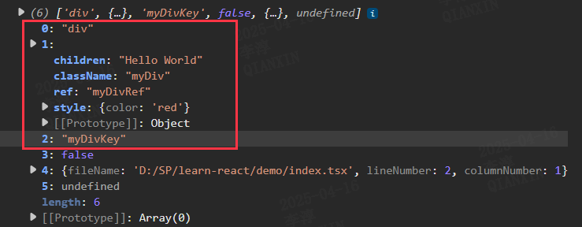

# 实现 JSX

## 什么是 JSX ?

我们在书写 React 的时候会使用这样的代码：

```jsx
const App = <div>123</div>;
```

在 React 17 以前（classic 模式），会被编译为如下代码，如以 babel 举例：

```js
const App = /*#__PURE__*/ React.createElement('div', null, '123');
```

可以看到 jsx 语法变成了对 React.createElement 方法的调用，但是文件中并没有引入这个方法，所以在 React 17 之前，我们需要在文件头显示引入 React。

```jsx
import React from 'react';
const App = <div>123</div>;
```

编译后如下：

```js
import React from 'react';
const App = /*#__PURE__*/ React.createElement('div', null, '123');
```

还是上面的示例，在 React 17 之后（automatic 模式），会被编译为如下代码：

```js
import { jsx as _jsx } from 'react/jsx-runtime';
const App = /*#__PURE__*/ _jsx('div', {
  children: '123',
});
```

可以看到，jsx 语法被编译为了对 react/jsx-runtime 中 jsx 方法的调用，如果在开发模式下，就是我们上一章看到的 react/jsx-dev-runtime，下面我们来实现 jsx 方法。

## 实现 JSX

jsx 方法返回一个 ReactElement, ReactElement 是一个轻量化的对象，用来描述 UI 视图，我们先来定义他的类型，先新建一个 shared 子包，存放各种通用的类型定义和辅助方法。

```ts
// /packages/shared/ReactTypes.ts
export type Type = any;
export type Key = any;
export type Ref = any;
export type Props = any;
export type ElementType = any;

export interface ReactElementType {
  $$typeof: symbol; // 通过这个symbol识别是不是一个ReactElement
  type: ElementType; // 组件类型
  key: Key; // 唯一key
  props: Props; // 除了ref以外的其他属性
  ref: Ref; // ref
  LEARN_REACT: boolean; // 识别是不是我们自己的react
}
```

新建 /packages/react/src/jsx.ts：

```ts
// /packages/react/src/jsx.ts
import { ReactElementType } from '../../shared/ReactTypes';

export const jsx = function (...params): ReactElementType {
  console.log(params);
};
```

修改 /packages/react/jsx-dev-runtime.ts：

```ts
// /packages/react/jsx-dev-runtime.ts
// [!code --:4]
export function jsxDEV(...params) {
  console.log(params);
  console.log('this is jsxdev');
}
// [!code ++]
export { jsx as jsxDEV } from './src/jsx';
```

我们来实现 jsx 方法，先来丰富一下我们仅有的这个 jsx 节点：

```ts
// /demo/index.tsx
const App = (
  <div
    className="myDiv"
    key="myDivKey"
    ref="myDivRef"
    style={{ color: 'red' }}
  >
    Hello World
  </div>
);

console.log(App);
```

打印结果如下：



我们只关心前三个参数即可，后面的都是在开发环境特殊的属性，我们不关心，前三个属性分别为：

:::info

- 组件类型
- 除了 key 以外的配置，包含 ref
- key

:::

我们来实现 jsx 方法，现在 shared 包下定义定义一个 symbol 作为全局标识符：

```ts
// /packages/shared/ReactSymbols.ts
export const REACT_ELEMENT_SYMBOL = Symbol.for('react.element');
```

```ts
// /packages/react/src/jsx.ts
import { REACT_ELEMENT_SYMBOL } from '../../shared/ReactSymbols';
import {
  Props,
  ReactElementType,
  Ref,
  Type,
  Key,
} from '../../shared/ReactTypes';

// 生成一个ReactElement
function ReactElement(
  type: Type,
  key: Key,
  ref: Ref,
  props: Props
): ReactElementType {
  const element: ReactElementType = {
    $$typeof: REACT_ELEMENT_SYMBOL,
    type,
    key,
    props,
    ref,
    LEARN_REACT: true,
  };

  return element;
}

export const jsx = function (
  type: Type,
  config: any,
  _key: Key
): ReactElementType {
  let key: Key = _key || null; // key需要单独提出来
  const props: Props = {};
  let ref: Ref = null;

  for (const prop in config) {
    const val = config[prop];
    switch (prop) {
      case 'ref': // ref单独拿出来
        ref = val;
        break;
      default:
        props[prop] = val; // ref以外的都属于props
        break;
    }
  }

  return ReactElement(type, key, ref, props);
};
```

到此，jsx 方法就实现完了，给我们的示例多加几个元素试试：

```tsx
// /demo/index.tsx
const App = (
  <div>
    <span>Hello</span>
    <span>World</span>
  </div>
);

console.log(App);
```

生成了嵌套的 ReactElement：


[本章代码](https://github.com/Cavendichun/learn-react/compare/feat/prepare-work...feat/jsx)
